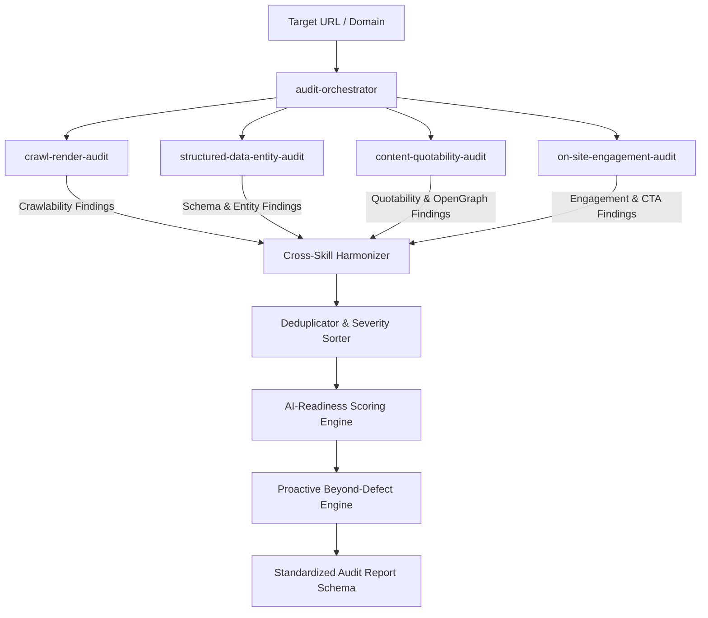

# Brand AI-Readiness Audit Marketplace
> **Adobe University Hackathon 2026 — Round 3 Submission**  
> An automated, multi-skill evaluation engine for assessing and remediating website **AI Discoverability** and **On-Site Engagement**.

---

## 1. Executive Summary

AI search assistants (such as ChatGPT Search, Perplexity, Claude Web, and Google AI Overviews) have fundamentally transformed how buyers and users discover products and information. Traditional SEO focused on keyword density and backlink counts; modern AI discovery depends on:
1. **Technical Crawler Accessibility**: Freedom from bot-blocking directives in `robots.txt` and JavaScript WAF challenges.
2. **Server-Rendered Machine Readability**: Full semantic content delivered in the initial HTML response without client-side rendering (CSR) hydration gaps.
3. **Structured Data & Entity Authority**: Semantic Schema.org JSON-LD triples and corroboration links (`sameAs`) across knowledge graphs (Wikidata, Wikipedia, LinkedIn).
4. **Content Quotability & RAG Retrieval**: High fact-to-noise ratio, structured Q&A formats, OpenGraph preview metadata, and absence of critical facts locked inside raster images.
5. **On-Site Orientation & Engagement**: Retaining AI referral traffic with clear above-the-fold value propositions, transparent heading hierarchies, outcome-oriented Call-to-Actions (CTAs), and low cognitive friction.

This repository provides an **Agent Skill Marketplace** conforming to the `agentskills.io` standard. It decomposes website auditing into specialized, focused domain skills coordinated by a single designated entrypoint skill (`audit-orchestrator`).

---

## 2. Marketplace Architecture & Composition

The marketplace follows a decoupled, progressive disclosure architecture:

```
brand-ai-readiness-audit/
├── marketplace.json                         # Marketplace registry manifest (audit-orchestrator as entrypoint)
├── README.md                                # Root documentation & composition guide
├── HOW_TO_RUN.txt                           # Running instructions & quick-start guide
├── run_audit.py                             # Single 1-command execution launcher
├── test_runner.py                           # Automated test suite (13 unit & integration tests)
├── package_submission.py                    # Submission packaging and verification utility
└── skills/
    ├── audit-orchestrator/                  # [ENTRYPOINT] Coordinates all skills & emits final report
    │   ├── SKILL.md                         # agentskills.io declaration & execution workflow
    │   ├── scripts/
    │   │   ├── orchestrate.py               # Main CLI executor & sub-skill orchestrator
    │   │   └── report_formatter.py          # Validates schema, calculates scores & formats Markdown
    │   └── references/
    │       ├── audit_report_schema.json     # Strict JSON Schema for output report
    │       └── scoring_methodology.md       # Severity definitions, scoring formula & prioritization
    │
    ├── crawl-render-audit/                  # [SKILL 1] Technical Crawlability & JS-Render Gaps
    │   ├── SKILL.md                         # Declaration & instructions
    │   ├── scripts/crawler.py               # Robots.txt parser (RFC 9309), WAF detection, CSR hydration check
    │   └── references/
    │       ├── ai_bot_user_agents.md        # Comprehensive index of AI search crawlers
    │       └── rendering_pitfalls.md        # Client-side hydration issues & crawler traps
    │
    ├── structured-data-entity-audit/        # [SKILL 2] Schema.org, Knowledge Graphs & Entity Authority
    │   ├── SKILL.md                         # Declaration & instructions
    │   ├── scripts/schema_inspector.py      # JSON-LD, Microdata, entity disambiguation analyzer
    │   └── references/
    │       ├── json_ld_templates.md         # Gold-standard Schema.org templates
    │       └── entity_corroboration.md      # sameAs, Wikidata, Wikipedia authority patterns
    │
    ├── content-quotability-audit/           # [SKILL 3] AI RAG Retrieval, Quotability & OpenGraph Cards
    │   ├── SKILL.md                         # Declaration & instructions
    │   ├── scripts/quotability_analyzer.py  # Fact density, Q&A extraction, OpenGraph & /llms.txt audit
    │   └── references/
    │       ├── rag_quotability_rules.md     # How LLM RAG pipelines retrieve and quote sources
    │       └── llms_txt_standard.md         # Modern /llms.txt standard implementation guide
    │
    └── on-site-engagement-audit/            # [SKILL 4] User Orientation, Information Architecture & CTAs
        ├── SKILL.md                         # Declaration & instructions
        ├── scripts/engagement_evaluator.py  # 3-second value prop, cognitive friction & CTA clarity
        └── references/
            ├── engagement_heuristics.md     # Cognitive load & context retention best practices
            └── friction_audit_checklist.md  # Modal fatigue, navigation depth & conversion friction
```

---

## 3. Skill Responsibilities & Separation of Concerns

| Skill ID | Domain | Round 2 Concepts Addressed | Key Signals Inspected |
|---|---|---|---|
| **`audit-orchestrator`** *(Entrypoint)* | Orchestration | All | Preflight validation, sub-skill invocation, cross-skill harmonization (merged H1 alerts), severity sorting, 0–100 AI readiness scoring, and proactive beyond-defect suggestions. |
| **`crawl-render-audit`** | Discoverability | A (Basics), C (Machine Reading) | RFC 9309 `robots.txt` agent group boundaries, case-insensitive bot matching (`ChatGPT-User`, `PerplexityBot`, `Claude-Web`), WAF interstitials (AWS WAF, Cloudflare, Akamai), `X-Robots-Tag`, and client-side rendering (CSR) hydration gaps. |
| **`structured-data-entity-audit`** | Discoverability | C (Machine Reading), D (Agreement across Web) | JSON-LD syntax validation, Schema.org entity inventory (`Organization`, `Product`, `Offer`, `BreadcrumbList`), external knowledge graph corroboration (`sameAs` links to Wikidata/Wikipedia/LinkedIn), and multi-currency pricing markup (€, £, ¥, ₹, USD). |
| **`content-quotability-audit`** | Discoverability | B (Assistant Retrieval), D (Agreement), F (Summarization Dropping) | Fact-to-jargon ratio, canonical entity definition sentences, structured Q&A / FAQ patterns, non-text locked facts (`` missing alt), OpenGraph citation preview tags (`og:title`, `og:description`, `og:image`), and `/llms.txt` support. |
| **`on-site-engagement-audit`** | Engagement | E (Context / Personalization), On-Site Engagement | 3-second above-the-fold value proposition, single canonical `<h1>` evaluation, sequential heading hierarchy (H1->H2->H3), prominent Call-to-Action (CTA) triggers, semantic `<nav>` structures, and reading friction. |

---

## 4. How the Entrypoint Composes the Skills

The entrypoint skill (`audit-orchestrator`) executes a deterministic, multi-stage pipeline:



### Deep Composition & Cross-Skill Harmonization
Rather than acting as a naive pass-through, `audit-orchestrator` implements **deep semantic composition**:
* **Cross-Skill H1 Harmonization**: If both `crawl-render-audit` (which inspects initial machine HTML) and `on-site-engagement-audit` (which inspects human visitor orientation) detect a missing `<h1>`, the orchestrator consolidates them into a unified, high-impact finding:
  > **`Missing <h1> headline (critical for both AI topic extraction and visitor orientation)`**
  synthesizing the evidence and providing clear remediation.
* **100% Copy-Pasteable Remediations**: Every finding emitted includes a concrete, mechanism-sound code snippet in `suggested_action.remediation_details` (e.g., exact Schema.org JSON-LD blocks, Nginx `X-Robots-Tag` headers, OpenGraph `<head>` tags, and `/llms.txt` templates).
* **Quantitative Scoring**: Computes a weighted overall `ai_readiness_score` (0–100) and domain sub-scores (`discoverability` and `engagement`).
* **Proactive Beyond-Defect Recommendations**: Synthesizes forward-looking actions (curated `/llms.txt`, Wikidata entity grounding, FAQ Schema) that elevate a site even where no technical bug was found.

---

## 5. Output Report Schema Compliance

The output conforms to the required hackathon schema:

```json
{
  "site": "example.com",
  "audited_at": "2026-09-20T14:32:00Z",
  "summary": {
    "total_findings": 6,
    "critical": 1,
    "high": 2,
    "medium": 3,
    "low": 0,
    "ai_readiness_score": 67,
    "scores": {
      "discoverability": 65,
      "engagement": 70
    }
  },
  "findings": [
    {
      "id": "F-001",
      "title": "No JSON-LD structured data on product pages",
      "severity": "high",
      "evidence": "Crawled product page; contains 0 schema.org markup blocks.",
      "suggested_action": {
        "summary": "Add Product/Offer JSON-LD to every product page.",
        "priority": "high",
        "remediation_details": "<script type=\"application/ld+json\">{\"@context\": \"https://schema.org\", \"@type\": \"Product\", \"name\": \"...\"}</script>"
      }
    }
  ],
  "proactive_recommendations": [
    {
      "area": "AI Discoverability",
      "title": "Publish Curated /llms.txt Machine Index",
      "impact": "Enables AI agents to ingest product specs without parsing complex HTML/CSS.",
      "action": "Create https://example.com/llms.txt with markdown summaries."
    }
  ]
}
```

---

## 6. How to Run

### Requirements
* **Python 3.8+**
* **Zero External Dependencies**: Standard library only (`urllib`, `json`, `html.parser`, `re`, `ssl`, `unittest`).

### 1. Single 1-Command Run (Audits Any Website)
```bash
# Direct terminal output:
python run_audit.py https://example.com

# Save JSON output to a file:
python run_audit.py https://example.com --output audit_report.json

# Display as an Executive Markdown summary:
python run_audit.py https://example.com --format markdown
```

### 2. Running via the Entrypoint Skill Directly
```bash
python skills/audit-orchestrator/scripts/orchestrate.py https://example.com
```

### 3. Running in Offline / Sandbox Mode
For offline evaluation without internet connectivity:
```bash
python run_audit.py example.com --offline-html /path/to/page.html --offline-robots /path/to/robots.txt
```

### 4. Running the Automated Test Suite
```bash
python test_runner.py
```
Executes **13 unit and integration tests** verifying `agentskills.io` compliance, manifest validity, RFC 9309 robots boundaries, WAF detection, CSR hydration, nested tag preservation, international currencies, OpenGraph checks, and schema validation.

### 5. Packaging the Submission
```bash
python package_submission.py
```
Validates all marketplace manifests, tests execution speed, and produces `brand-ai-readiness-audit.zip` (< 50 MB).

---

## 7. Safety, Guardrails & Compliance

* **Recommend-Only**: Does not modify live sites or perform any authenticated or state-altering requests.
* **Polite Execution**: Employs configurable timeouts, user-agent identification, and robots.txt adherence.
* **Zero Dependencies**: Requires no `pip install` or external binaries. Runs natively in any standard Python environment.
* **Sandbox Safe**: Self-contained package under 70 KB (well below the 50 MB limit).
* **Execution Speed**: Full multi-skill audit finishes in 4–8 seconds (well below the 5-minute ceiling).
