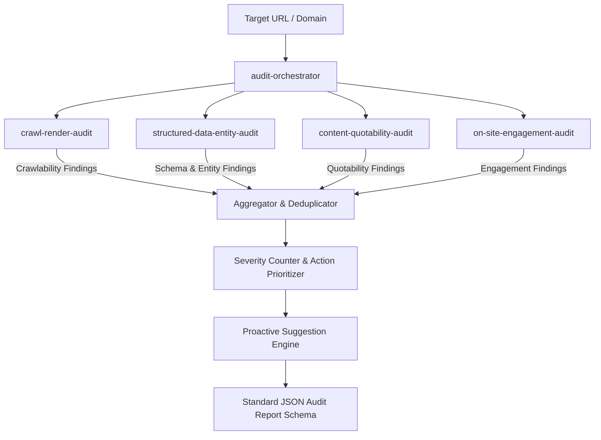

# Brand AI-Readiness Audit Marketplace
> **Adobe University Hackathon 2026 — Round 3 Submission**  
> An automated, multi-skill evaluation engine for assessing and remediating website **AI Discoverability** and **On-Site Engagement**.

---

## 1. Executive Summary

AI assistants (such as ChatGPT, Perplexity, Claude, and Google AI Overviews) have revolutionized how users discover products and information. Traditional SEO focused on keyword matches and backlink counts; modern AI discovery depends on **crawler accessibility**, **server-rendered machine readability**, **entity disambiguation across knowledge graphs**, **information density**, and **quotable factual extractions**. Concurrently, visitors arriving from AI summaries require instant **orientation and low-friction engagement** to prevent immediate bounce.

This repository provides an **Agent Skill Marketplace** conforming to the `agentskills.io` standard. It decomposes website auditing into specialized, focused skills coordinated by a central entrypoint skill (`audit-orchestrator`).

---

## 2. Marketplace Architecture & Composition

The marketplace follows a decoupled, progressive disclosure architecture:

```
brand-ai-readiness-audit/
├── marketplace.json                         # Marketplace registry manifest (entrypoint designated)
├── README.md                                # Root documentation & composition guide
├── test_runner.py                           # Full automated test suite & fixtures
├── package_submission.py                    # Packaging verification script
└── skills/
    ├── audit-orchestrator/                  # [ENTRYPOINT] Coordinates all skills & formats report
    │   ├── SKILL.md                         # agentskills.io declaration & execution workflow
    │   ├── scripts/
    │   │   ├── orchestrate.py               # Main CLI executor & sub-skill orchestrator
    │   │   └── report_formatter.py          # Validates & formats required JSON output schema
    │   └── references/
    │       ├── audit_report_schema.json     # Strict JSON Schema for output report
    │       └── scoring_methodology.md       # Severity definitions & prioritization rubric
    │
    ├── crawl-render-audit/                  # [SKILL 1] Technical Crawlability & JS-Render Gaps
    │   ├── SKILL.md                         # Declaration & instructions
    │   ├── scripts/crawler.py               # Robots.txt parser (AI bots), sitemaps & hydration check
    │   └── references/
    │       ├── ai_bot_user_agents.md        # Comprehensive index of AI search crawlers
    │       └── rendering_pitfalls.md        # Client-side hydration issues & crawler traps
    │
    ├── structured-data-entity-audit/        # [SKILL 2] Schema.org, Knowledge Graphs & Entity Authority
    │   ├── SKILL.md                         # Declaration & instructions
    │   ├── scripts/schema_inspector.py      # JSON-LD, Microdata, entity disambiguation analyzer
    │   └── references/
    │       ├── json_ld_templates.md         # Gold-standard Schema.org templates
    │       └── entity_corroboration.md      # sameAs, Wikidata, Wikipedia authority patterns
    │
    ├── content-quotability-audit/           # [SKILL 3] AI RAG Retrieval, Information Density & Quotability
    │   ├── SKILL.md                         # Declaration & instructions
    │   ├── scripts/quotability_analyzer.py  # Fact density, Q&A extraction & non-text locked facts
    │   └── references/
    │       ├── rag_quotability_rules.md     # How LLM RAG pipelines retrieve and quote sources
    │       └── llms_txt_standard.md         # Modern /llms.txt standard implementation guide
    │
    └── on-site-engagement-audit/            # [SKILL 4] User Orientation, IA & Conversion Friction
        ├── SKILL.md                         # Declaration & instructions
        ├── scripts/engagement_evaluator.py  # 3-second value prop, cognitive friction & CTA clarity
        └── references/
            ├── engagement_heuristics.md     # Cognitive load & context retention best practices
            └── friction_audit_checklist.md  # Modal fatigue, navigation depth & conversion friction
```

---

## 3. Skill Responsibilities & Separation of Concerns

| Skill ID | Role | Round 2 Failure Modes Addressed | Key Signals Inspected |
|---|---|---|---|
| **`audit-orchestrator`** *(Entrypoint)* | Composes domain audit skills, aggregates findings, enforces severity ranking, dedupes evidence, and outputs conforming JSON & Markdown reports. | All | Output schema validation, severity aggregation, proactive beyond-defect recommendations. |
| **`crawl-render-audit`** | Detects crawler barriers and client-side rendering traps. | A (Basics), C (Machine Reading) | Robots.txt directives for AI agents (`GPTBot`, `ClaudeBot`, `PerplexityBot`, etc.), HTTP response headers, meta robots tags, XML sitemaps, client-side hydration gaps (empty root div vs rendered DOM). |
| **`structured-data-entity-audit`** | Evaluates machine-readable semantic data and entity authority. | C (Machine Reading), D (Agreement across Web) | JSON-LD / Microdata presence and validity, Organization / Product / FAQ / Article schemas, entity disambiguation (`sameAs` links to Wikidata/Wikipedia/LinkedIn), machine-quotable factual triples. |
| **`content-quotability-audit`** | Evaluates how readily AI RAG pipelines can extract and cite facts. | B (Assistant Retrieval), D (Agreement), F (Summarization Dropping) | Fact-to-noise ratio, structured Q&A / FAQ patterns, facts locked inside raster images (`` without alt) or canvas, presence and formatting of `/llms.txt`. |
| **`on-site-engagement-audit`** | Evaluates post-click visitor retention, orientation, and friction. | E (Context / Personalization), On-site Engagement | Above-the-fold value proposition (3-second rule), heading hierarchy (H1-H3), cognitive load & readability, call-to-action (CTA) clarity, modal/popup friction. |

---

## 4. How the Entrypoint Composes the Skills

The entrypoint skill (`audit-orchestrator`) coordinates the audit via the following deterministic pipeline:



1. **Target Ingestion & Validation**: Safe normalization of URLs, host validation, protocol verification.
2. **Polite Crawling & Inspection**: Executes read-only checks respecting robots.txt and network timeouts (< 5s per request, < 5 minutes total runtime).
3. **Execution of Domain Audits**: Each domain skill runs deterministic checks against the site's network response, HTML, and assets.
4. **Aggregation & Normalization**: Collects all findings, assigns unique IDs (`F-001`, `F-002`, etc.), maps severities (`critical`, `high`, `medium`, `low`), and generates mechanism-sound remediation actions.
5. **Proactive Recommendation Engine**: Generates beyond-defect improvements (e.g., automated `/llms.txt` generation, FAQ schema injection, `sameAs` entity knowledge graph links).
6. **Schema Enforcement**: Emits the required JSON audit report strictly matching the hackathon specification.

---

## 5. Output Report Schema Compliance

The output strictly complies with the hackathon specification:

```json
{
  "site": "example.com",
  "audited_at": "2026-09-20T14:32:00Z",
  "summary": {
    "total_findings": 6,
    "critical": 1,
    "high": 2,
    "medium": 3
  },
  "findings": [
    {
      "id": "F-001",
      "title": "No JSON-LD structured data on product pages",
      "severity": "high",
      "evidence": "Crawled 12 product pages; 0/12 contain schema.org markup.",
      "suggested_action": {
        "summary": "Add Product/Offer JSON-LD to every product page.",
        "priority": "high"
      }
    }
  ]
}
```

---

## 6. How to Run

### Requirements
- Python 3.8+ (zero external dependencies required; standard library `urllib`, `json`, `html.parser`, `re` are used throughout).

### Running a Live Audit via the Entrypoint
```bash
# From the marketplace root:
python skills/audit-orchestrator/scripts/orchestrate.py https://example.com
```

### Running with JSON Output Saved to File
```bash
python skills/audit-orchestrator/scripts/orchestrate.py https://example.com --output report.json
```

### Running the Automated Test Suite & Fixtures
```bash
python test_runner.py
```

### Packaging for Submission
```bash
python package_submission.py
```
This validates all `agentskills.io` manifests, checks file sizes, and generates `brand-ai-readiness-audit.zip` (< 50 MB).

---

## 7. Safety, Guardrails & Compliance

- **Recommend-Only**: Does not modify live sites or perform any authenticated or state-altering requests.
- **Polite Execution**: Employs configurable timeouts, user-agent identification, and robots.txt adherence.
- **Sandbox Safe**: Self-contained Python scripts with no pre-trained weights or binary dependencies. Total size < 200 KB (well within the 50 MB limit).
- **Execution Speed**: Completes full multi-skill audit in under 10 seconds for a typical site (well within the 5-minute ceiling).
